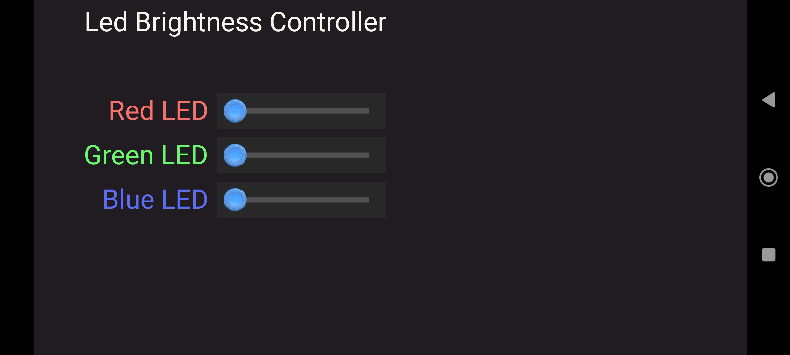

# Ejemplo Bluetooth LED RGB

Este proyecto ejemplifica el uso del módulo de comunicación Bluetooth Low Energy (BLE) junto con el manejo de tiras de LEDs RGB.
Permite manejar la tonalidad e intensidad del LED RGB incluído en la placa ESP-EDU, mediante una aplicación móvil.

## Cómo usar el ejemplo

### Hardware requerido

* ESP-EDU
* Dispositivo Android

### Configurar el proyecto

Para poder utilizar las funcionalidades de BLE en el ESP32, en primer lugar es necesario habilitar dicho módulo en el `sdkconfig`. Para ello puede copiar el `sdkconfig` de este proyecto (que ya se encuentra modificado) o modificar el propio:

1. Abrir `ESP-IDF: SDK Configuration Editor`:   
2. Buscar "Bluettoth" y habilitar la casilla `Bluetooth`
3. Buscar "4.2" y habilitar la casilla `Enable BLE 4.2 features`

Paso seguido debe modificar el `CMakeLists` de la carpeta `drivers`, descomentando la línea:

```cmake
#"microcontroller/src/ble_mcu.c"
```

En este proyecto ya se han realizado estas modificaciones, por lo tanto no es necesaria ninguna acción extra para probarlo.

### Ejecutar la aplicación

1. Instalar y ejecutar en el dispositivo Android la aplicación [Bluettoth Electronics](https://play.google.com/store/apps/details?id=com.keuwl.arduinobluetooth)
2. Presionando en el botón `Connect`, vincular el móvil con la placa (se mostrará con el nombre `ESP_EDU_1`)
3. Seleccionar y ejecutar el ejemplo `Led Brightness Controller`

    

4. Mover los "slidebar" para modificar la tonalidad del LED RGB
