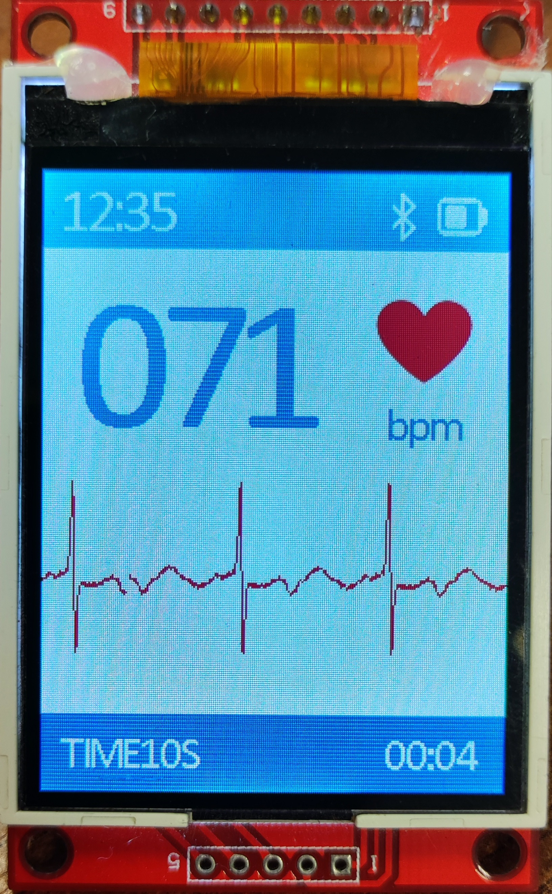

# Ejemplo Display LCD Color - Filtros

Este proyecto ejemplifica el uso de la `pantalla LCD color` para graficar una señal temporal. Emula la interfaz del Monito de ECG Portable BeC: [bececg.com](https://bececg.com/)
También se ejemplifica el uso del reloj de tiempo real `RTC`.
 
## Cómo usar el ejemplo

### Hardware requerido
* ESP-EDU
* Display LCD color

#### Conexiones:
 |   	Display		|   ESP-EDU		|
 |:--------------:|:--------------|
 | 	SDO/MISO 	|	GPIO_22		|
 | 	LED		 	| 	3V3			|
 | 	SCK		 	| 	GPIO_20		|
 | 	SDI/MOSI 	| 	GPIO_21		|
 | 	DC/RS	 	| 	GPIO_9		|
 | 	RESET	 	| 	GPIO_18		|
 | 	CS		 	| 	GPIO_19		|
 | 	GND		 	| 	GND			|
 | 	VCC		 	| 	3V3			|
 

### Configurar el proyecto
Para utilizar las funcionalidades de DSP es necesario agregar la capa middelware al proyecto, modificando el archivo CMakeLists.txt (ubicado en la raiz del proyecto) con el siguiente contenido:
```
 cmake_minimum_required(VERSION 3.16)

list(APPEND EXTRA_COMPONENT_DIRS "../../drivers")
list(APPEND EXTRA_COMPONENT_DIRS "../../middelware")

include_directories(${PROJECT_NAME} ../../drivers)
include_directories(${PROJECT_NAME} ../../middelware)
include($ENV{IDF_PATH}/tools/cmake/project.cmake)
project(ej_dsp)
```
En este proyecto ya se han realizado estas modificaciones, por lo tanto no es necesaria ninguna acción extra para probarlo.

### Ejecutar la aplicación
1. Conectar la pantalla LCD según las indicaciones anteriores.
2. Al correr el programa podrá observar la siguiente interfaz:
